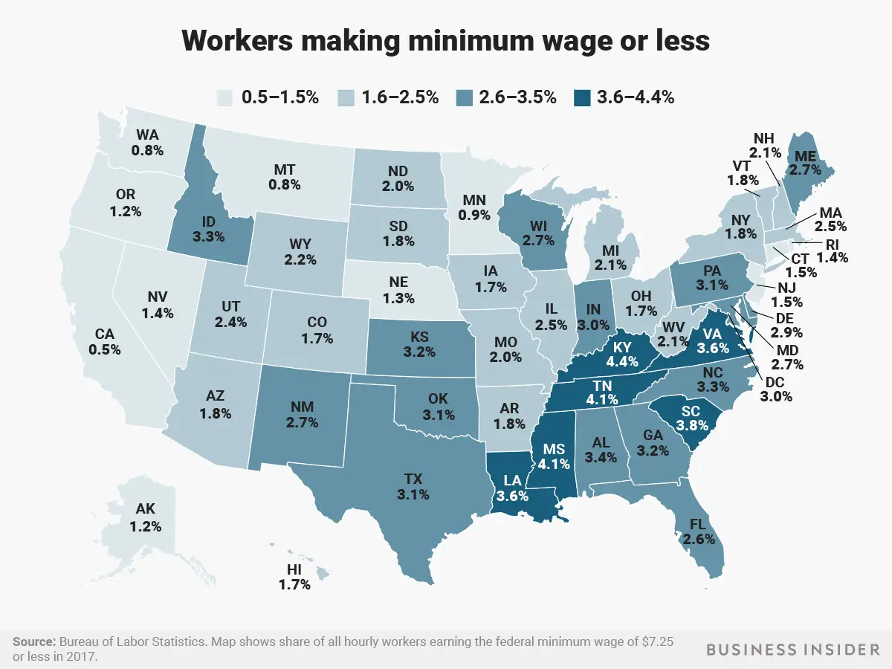
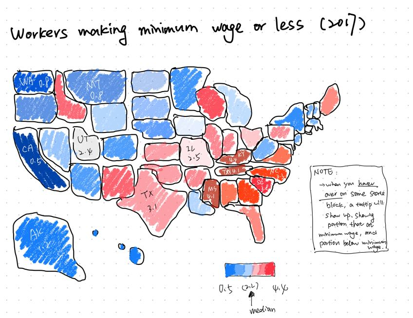
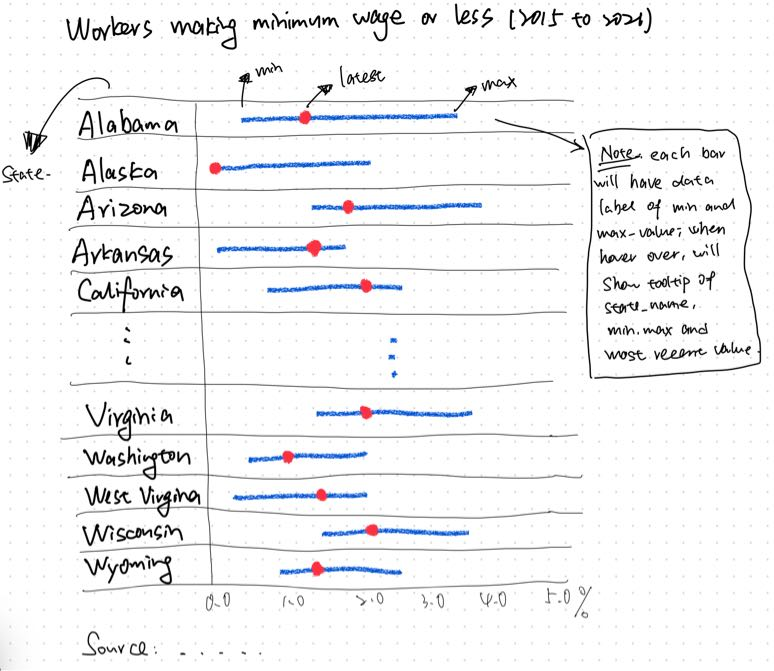

## Assignment#3&4

### Step one: choose a data visualization from MakeoverMonday
I choose the ["How many people earned the Federal minimum wage or less in each State?"](https://www.businessinsider.com/federal-minimum-wage-workers-map-2018-10?r=US&IR=T) from the [MareoverMonday (2023 Section)](https://www.makeovermonday.co.uk/data/). Below is the original data visualization:

- Source: https://www.businessinsider.com/federal-minimum-wage-workers-map-2018-10?r=US&IR=T
- Data Source: [Bureau of Labor Statistics](https://www.bls.gov/opub/reports/minimum-wage/2021/home.htm)

### Step two: critique the data visualization

The data visualization effectively communicates the geographic distribution of minimum wage earners across the United States, a strong aspect that stands out at first glance. The map is suitably used for this data type, and the color gradient highlights state differences, meriting an 8 out of 10 for usefulness and a 7 out of 10 for intuitiveness, as the color shades chosen could be improved for clarity.

What worked well is the *categorization into percentage ranges*, allowing for a swift visual assessment of minimum wage earner prevalence. The visualization's clarity and the focused use of a single color with varying intensities maintain the data's prominence. Information is easily perceivable, with clear color contrast and legible text, warranting a 7 out of 10 for perceptibility.

However, the similar shades of blue could pose difficulties for color-blind users, and the map lacks context for the numbers, such as state workforce sizes, which would provide a clearer picture of the number of workers earning minimum wage or less. Also, the plot just mentions the year (2017) in the source, which is in a really small font size. Would be better to put the year in the plot title. If data from other years are available, it could be added to make comparisons and possibly identify trends for each state.

To improve, I would prefer introducing **clearer color distinctions** or patterns for different ranges to enhance accessibility. Including **interactive elements**, like hover-over details, could offer additional context, such as the size of the labor force and historical data for trend analysis. A bar plot could also be considered as an alternative to better communicate the information.

### Step three: sketch out a solution
Below is my sketch:

In the redesign of the sketch, I stuck with the map layout because it’s a familiar and effective way to show regional data. For the color scheme, I flipped to red-blue (reversed) and pivoted around the median value of 2.2%. This approach means that darker reds indicate higher percentages, while darker blues represent lower percentages. This color choice is advantageous because it provides a clear visual contrast that can help to quickly differentiate states with higher versus lower proportions of minimum wage workers—reds jump out for areas of concern, while blues recede for less affected areas. I've also updated the title to include the year "2017" for clear temporal context. Additionally, I added interactive tooltips that reveal more details—like the state name, the percentage at minimum wage, the percentage below minimum wage, and the total percentage for that state—when you hover over each state. This feature enriches the map with valuable data points and enhances user engagement without cluttering the visual space.

### Step four: Test the solution

Interview questions script:
- Looking at this map, what information do you think it's trying to convey?
- As you examine this visualization, what stands out to you, and what—if anything—do you find unclear or puzzling?
- What additional information or details would you be curious to see, or would you expect to find in this visualization?
Document what you changed based on the user feedback in your redesign.

**studentA, mid 20's**

  1. The map seems to be showing the percentage of workers earning minimum wage or less across different states in the U.S. for the year 2017.

  2. The red and blue color scheme pops and makes it easy to spot which states have higher and lower percentages of minimum wage workers. But it's a bit confusing because there's no legend explaining the colors. Also, the note on the side is kinda squished and hard to read.

  3. I’d expect to see some kind of legend or key to make sense of the colors at a glance. Also, it'd be cool to see some numbers on how the percentages have changed over time, like a little trend line or something for each state when you hover over it. And why you choose year 2017? I think the audience would like to see more recent statistics or at least and latest info.
  
  
**studentB, mid 20's**

  1. This map's showing us where in the U.S. people are earning around minimum wage, kind of painting a picture of the economic landscape state by state for 2017.

  2. The switch-up with darker reds for higher rates and darker blues for lower ones is clever—really makes the high-low divide jump out at you. But hey, what do the different shades mean exactly? And that note scribbled on the side is tricky to make out, makes me squint.

  3. Would be neat to see some stats on how these numbers have shifted over the past few years, give a sense of whether things are getting better or worse. And how about a quick explainer for the color shades? I would also suggest try other kind of visualizations like bar plot. It maybe better to show the trend over years than map, as stats would not stack together. I'm curious about the data behind the map. Like, what’s the overall national average, and how do states compare to it? Also, it'd be interesting to see some demographic breakdowns, maybe age or industry, to get a deeper understanding of the workforce in each wage bracket.

For the final redesign based on the feedback, the following changes could be considered:

- Introduce a clear and concise legend for the color scale.
- Enhance readability of annotations or notes on the visualization.
- Incorporate interactive elements to display trends over time for each state.
- Update the dataset to the most recent year available to increase relevance.
- Explore alternative visualization types, such as bar plots, to represent trends more effectively.
- Include additional context like national averages and demographic breakdowns to provide a more comprehensive understanding of the data.

Feedback from the interviews highlights two main areas for the redesign: the need for a legend to decode the color scheme and enhanced data presentation for clarity and depth. Users suggested clearer annotations, trend data over time, and more current statistics. Based on this and reviewed the [data source](https://data.world/makeovermonday/2023w18) thoroughly, I redo the sketch.

I chose a bullet graph this time to incorporate all available data from 2015 to 2021. For each state, I started the bar at the minimum percentage and ended at the maximum, highlighting the latest year's percentage with a red dot. This design clearly shows the data's range and progression over time, making it easier to compare and analyze the changes.

### Step five: Final solution

After considering the feedback I received on my sketches, I decided to revise my approach for the final visualization. I wanted to find a way to integrate elements from both of my initial designs, but I found myself a bit stuck. Seeking inspiration, I revisited MakeoverMonday and watched a "Watch Me Viz" video. To my surprise, the tutor's proposed solution was precisely what I had been looking to create. I chose to follow the tutorial and replicate the visualization for my final piece. Another reason for this decision was my fascination with how the tutor used different shapes, specifically polygons, to represent each state and incorporated a linked chart inside. This technique seemed both intriguing and challenging to execute in Tableau, and I was eager to learn how to do it. Below is the link to my final visualzation and wrap-up summary.

[This is the final visualization learned from Andy Kriebel](ass3&4_finalViz.md)

### Future Work

 I would like to explore additional avenues if I had more time to dedicate to this project. One aspect that intrigues me is the variation in state-level minimum wages compared to the federal standard. It feels somewhat counterintuitive to analyze federal minimum wage trends on a state-by-state basis without accounting for these differences. If possible, I'd like to find a way to normalize these thresholds to determine whether a universal minimum wage standard is necessary. Perhaps we could differentiate the states with two colors—one for those using the federal threshold and another for states with their own—then analyze them separately.

Another dimension I'm considering is moving beyond percentages to actual population figures, which could convey more concrete information. We could also refine the scope of our analysis for more precise insights. For example, we could compare the populations of women and men at or below the minimum wage threshold across different states. This focused approach could yield a better understanding of the wage gap and its implications.
