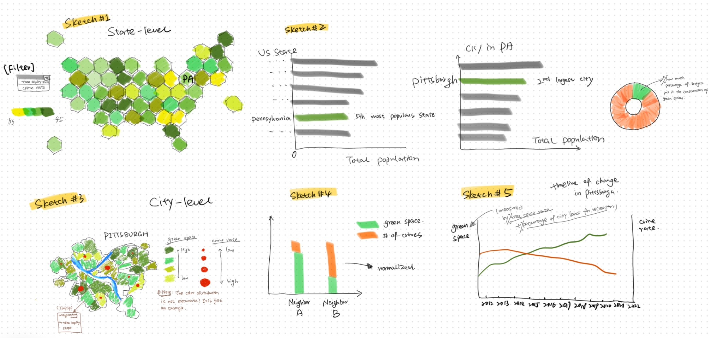

## [Final Project Part I](README.md)

## Green Spaces vs. Crime Rates: A Visual Analysis of Pittsburgh's Urban Landscape

### High-level summary of project:

For my final project, I plan to focus on the city of Pittsburgh to investigate the intersection of urban greenery and crime rates, a pivot from my earlier research which explored the broader issue of access to green spaces across Pennsylvania, with a focus on ethnic disparities. This prior work, which utilized geographic visualizations, laid a foundation for understanding the nuances of green space distribution. Now, I seek to narrow the scope, both geographically to Pittsburgh and thematically to the correlation between green spaces and crime rates, utilizing a diverse array of data visualizations and new data dimensions, such as tree cover scores, to delve deeper into this compelling topic.

With the majority of Americans living in cities, the quest for ample and equitable urban green spaces is more than an amenity—it's essential for the collective well-being and quality of life ([Wagner, 2023](https://www.synlawn.com/commercial-projects/urban-hardscape-transformed-into-a-community-green-space/)). I am also inspired by studies like the one conducted in Philadelphia's New Kensington neighborhood, where vacant land accounted for an average of 10% of parcels per block, revealing the urban tapestry of undeveloped spaces within a bustling cityscape ([Wachter, 2005](https://library.weconservepa.org/library_items/1032-The-Determinants-of-Neighborhood-Transformations-in-Philadelphia-Identification-and-Analysis-The-New-Kensington-Pilot-Study)). While Pittsburgh-specific data on the relationship between green spaces and social dynamics are scarce, the implications of such disparities as found in Philadelphia provide a guiding beacon for this research. It suggests a pattern that might be replicated or contrasted in Pittsburgh, offering a rich avenue for discovery.

By integrating new forms of data visualizations and leveraging datasets such as tree equity scores, I will probe deeper into Pittsburgh's green infrastructure. The city's progressive efforts to augment green spaces and promote tree equity will be juxtaposed against this backdrop, scrutinizing whether these urban greening initiatives could be a beacon for enhancing public safety and reducing crime rates.

This project is not just an academic exercise but a narrative that addresses an urgent environmental issue with deep societal implications. By highlighting the importance of tree equity, I hope to underscore the role that urban green spaces play in fostering healthier, safer communities.

 - **One line summary**: In Pittsburgh, the connection between urban green spaces and crime rates is not just an environmental issue, but a deeper exploration into urban safety and community well-being.
 - **Reader’s Perspective**: As a reader, I am intrigued to understand how Pittsburgh's greenery influences local crime rates and what this means for urban planning and safety.
 - **Call to Action**: We can make a real difference by getting involved with Pittsburgh's tree equity and urban greening initiatives. Whether it's participating in local tree-planting events, joining community discussions, or supporting policies for equitable green spaces, our actions can contribute to creating a safer, greener, and more inclusive Pittsburgh.

### An Outline
- **Introduction**
  - Opening: Set the scene with an engaging introduction about Pittsburgh, its relevance as a vibrant urban area, and the importance of understanding the relationship between green spaces and crime rates.
  - Thesis Statement: Present the central argument or hypothesis that areas with more green spaces in Pittsburgh might correlate with lower crime rates.

- **Contextual Background**
  - National Overview (**Sketch #1**): In this initial sketch, I'm drawing on techniques from [Andy Kriebel's Tableau tutorial](https://www.youtube.com/watch?v=uBivjyfk0Sg) to create an *interactive map* that showcases the green space in each state with a gradient from yellow to green, representing tree equity scores. This visual tool will include a handy filter feature that lets users switch the view to crime rates, illustrated with an orange to red color scale. I'm aiming to spotlight Pennsylvania, as well as any states that show a striking contrast, like low green space coupled with high crime rates, to add an interesting layer of comparison. This map will serve as a national backdrop for the deeper dive into Pittsburgh's green space dynamics. (Data Source: [Tree Equity Score](https://www.treeequityscore.org/methodology#3.69/38.45/-100.76), [Crime Rate](https://worldpopulationreview.com/state-rankings/crime-rate-by-state), [Hexbin Shapefile](https://vizpainter.com/hex-map-spatial-file/))
  - Narrow in on Pennsylvania, but specifically the Greater Pittsburgh region (**Sketch #2**): For Sketch #2, I'm zooming into Pennsylvania, especially the Greater Pittsburgh area, using a series of *bar graphs* to compare the total population and population density of the top U.S. states, highlighting Pennsylvania's position as the 5th most populous. In the bar graph where Pittsburgh stands out as the second-largest city in PA, I'm considering adding another visualization to make the story more compelling. Alongside this, I plan to use a *donut chart* to represent Pittsburgh's investment in green spaces, showing the percentage of the city's budget allocated to these efforts. It’s a visual narrative about where the city places its priorities and how serious it is about improving green spaces. The purpose is to illustrate not only the scale of the city's green ambitions but also to provide context for how Pittsburgh's green space efforts compare to its size and population—do larger investments correlate with its standing as a major city within Pennsylvania? This could offer insights into the effectiveness and reach of such urban greening initiatives. (Data Source:[WiseVoter - States by Population](https://wisevoter.com/state-rankings/states-by-population/),[Cities by Population in PA](https://worldpopulationreview.com/states/cities/pennsylvania),[Budget allocation of Pittsburgh](https://data.wprdc.org/tr/dataset/city-pittsburgh-operating-budget))

- **Detailed City Analysis**
  - City-Level Distribution (**Sketch #3**): For Sketch #3, I'm focusing on Pittsburgh itself. I've mapped out the city to display the green spaces using a gradient of colors that reflect different levels of tree equity scores—the deeper the green, the higher the score. I'm overlaying this map with solid circles that represent crime hotspots; larger circles denote areas with more severe criminal activity. My aim is to visually correlate the density of green spaces with crime rates, hoping to observe that neighborhoods with higher tree equity scores might show smaller crime hotspots. (Data Source:[Crime in Pennsylvania Dashboard](https://www.ucr.pa.gov/PAUCRSPUBLIC/Home/Index),[Tree Equity Score](https://www.treeequityscore.org/methodology#3.69/38.45/-100.76))
  - Comparative Analysis (**Sketch #4**): In Sketch #4, I'm using comparative bar graphs to get into the specifics of green space and crime rates across different neighborhoods in Pittsburgh. The bars are dual-layered, with green representing the amount of green space and orange for the number of crimes, normalized to allow for accurate comparisons regardless of neighborhood size or population. (Data Source:[Crime in Pennsylvania Dashboard](https://www.ucr.pa.gov/PAUCRSPUBLIC/Home/Index),[Tree Equity Score](https://www.treeequityscore.org/methodology#3.69/38.45/-100.76))
  - Temporal Trends (**Sketch #5**): In Sketch #5, I plan to illustrate the evolution of Pittsburgh's urban landscape with a timeline graph that traces the changes in green space development against crime rates over the years. This line graph will measure green space through the lens of tree cover rates and available land for recreation, while plotting crime rates alongside. The goal is to provide a historical view, revealing whether there's a visible trend or correlation between the increase in green spaces and a shift in crime rates. (Data Source:[Crime in Pennsylvania Dashboard](https://www.ucr.pa.gov/PAUCRSPUBLIC/Home/Index),[Tree Equity Score](https://www.treeequityscore.org/methodology#3.69/38.45/-100.76))

- **Discussion**
  - Analysis of Findings: Discuss the insights gained from the visualizations, including any trends, patterns, or anomalies. Examine the relationship between green spaces and crime rates and whether the data supports the initial hypothesis.
  - Implications: Highlight Reader’s Perspective, considering the broader implications of findings for urban planning, policy-making, and community safety.

- **Conclusion**
  - Summary of Key Points: Recap the major elements of the story, reiterating the findings and their significance.
  - Call to Action: Encourage further research, policy consideration, or community engagement based on the insights provided by the analysis.

### Initial Sketches:

### Identify primary data sources:
| Name                                 | URL                                                                          | Description |
|--------------------------------------|------------------------------------------------------------------------------|-------------|
| 1. Tree Equity Score                 | [Link](https://www.treeequityscore.org/methodology#3.69/38.45/-100.76)       | It provides information on tree equity, tree canopy, priority index, and other demographic and accessibility information.             |
| 2. State-level Crime Rate            |  [Link](https://worldpopulationreview.com/state-rankings/crime-rate-by-state)|    It provides state-level crime reate data.         |
| 3. Pittsburgh Crime Rate             | [Link](https://www.ucr.pa.gov/PAUCRSPUBLIC/Home/Index)                       |   It provide pittsburgh crime rate by neighborhood.          |
| 4. WiseVoter - States by Population  | [Link](https://wisevoter.com/state-rankings/states-by-population/)           | It provides data on the total, male and female, and density of the population in each state.  |
| 5. Cities by Population in PA        | [Link](https://worldpopulationreview.com/states/cities/pennsylvania)         | It provides data on a city-level population in PA. |
| 6. Budget allocation of Pittsburgh   | [Link](https://data.wprdc.org/tr/dataset/city-pittsburgh-operating-budget)   | This dataset shows the 2011-YTD operating budgets for the City of Pittsburgh.  |
| To be continue...                    |                                                                              |   |
### Method and Medium:
For the execution of my final project, I've chosen to weave my narrative through **Shorthand**, which is quite engaging and user-friendly. This choice is inspired by exemplary projects showcased in our class, which highlighted Shorthand's efficacy in presenting complex information. My visualizations will primarily be crafted using **Tableau** and **ArcGIS Pro**, tools that offer a robust framework for creating dynamic and insightful data representations. Additionally, to add an element of visual clarity and appeal, I am considering integrating infographics designed with **Canva**. This combination ensures that the visual storytelling is not only comprehensive but also compelling.

The aim is to create a singular, immersive experience where users can access and understand key information about urban green spaces and their impact on community safety, sparking further interest and encouraging them to delve deeper into the subject of tree equity and its importance in urban planning.
### References:
1. Wagner, M. (2023, February 2). Urban Hardscape Transformed into a Community Green Space. SYNLawn. [https://www.synlawn.com/commercial-projects/urban-hardscape-transformed-into-a-community-green-space/](https://www.synlawn.com/commercial-projects/urban-hardscape-transformed-into-a-community-green-space/)
2. Wachter, S. (2005). The determinants of neighborhood transformations in Philadelphia identification and analysis: The New Kensington pilot study. Retrieved from [https://library.weconservepa.org/library_items/1032-The-Determinants-of-Neighborhood-Transformations-in-Philadelphia-Identification-and-Analysis-The-New-Kensington-Pilot-Study](https://library.weconservepa.org/library_items/1032-The-Determinants-of-Neighborhood-Transformations-in-Philadelphia-Identification-and-Analysis-The-New-Kensington-Pilot-Study)
